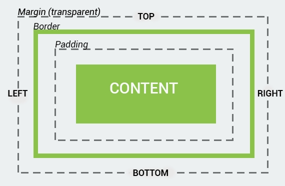

## 一.盒模型概述



+	**margin** 外边距
+	**border** 边框
+	**padding** 填充
+	**content** 内容区

## 二.盒模型的宽（高度同理）
+	宽度：内容区宽度+左右内边距之和+左右边框宽度之和
+	**box-sizing** 属性
1.	`content-box` (默认)
	**width** 属性=内容区宽度
2.	`border-box`
	**width** 属性=内容区宽度+左右内边距之和+左右边框宽度之和

## 三.边框
1.	语法
```CSS
/*合并设置*/
border:大小width 颜色color 样式style;
/*分边设置*/
border-top:大小width 颜色color 样式style;
/*分开设置*/
border-color:...;
border-top-color:...;
```

2.	边框样式 **style**
	+	**none** 没有(默认)
	+	**solid** 直线
	+	**dotted** 点状
	+	**dashed** 点状(每个点稍微长一点)
	+	**double** 双实线
	+	**groove** 3D凹槽边框
	+	**ridge** 3D 垄状边框
	+	**inset** 3D内折边框（像按钮点击时的样子）
	+	**outset** 3D外折边框（像按钮的样子）

## 四.背景
1.	背景颜色 **background-color**
	+	**颜色名称关键词** red、blue等
	+	**十六进制值** #fff、#000、#6e6e6e等
	+	**RGB** rgb(255,255,255)、rgba(0,0,0,0.5)等

2.	背景图片
	+	**background-image** url(图片地址),url(图片地址),...
	+	**background-repeat** 可用值： repeat-x,repeat-y,repeat(默认),no-repeat
	+	**background-attachment** 可用值：scroll(随滚动条一起滚动),fixed(固定)
	+	**background-position** 背景图片的起始位置，可选的值：垂直属性(top,center,bottom) 水平属性(left,center,right) 或大小
	+	**background-size** 背景图片的大小，可选值:大小, `cover`(100%)` contain` (图片刚好在内容区)

3.	背景设置
	+	**background-origin** 规定背景如何定位 `padding-box` `content-box` 	`border-box`
	+	**background-clip** 规定背景的绘制区域 `padding-box` `content-box` 	`border-box`

## 五.行为方式

1.	`display` 属性：指定盒模型的行为方式 
	+	`none`隐藏 ，不占空间
	+	`block`块状，占用100%宽度
	+	`inline-block` 只占用尽可能多的宽度，不换行
	+	`inline` 只占用尽可能多的宽度，换行

## 六.圆角
```CSS
border-radius:左上 右上 右下 左下; 
```

## 七.盒子阴影
```CSS
box-shadow:水平距离 垂直距离 模糊(不允许负值) 尺寸 颜色 [inset]
```

