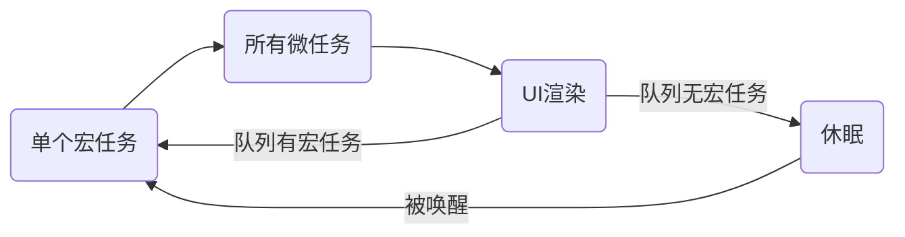

## 一.同步和异步
### 概念
#### 同步
调用函数时，调用方得等待这个调用返回结果才能继续往后执行。

下面的三个函数，先执行 `a`，等 `a`有返回值了再执行 `b`，最后执行 `c`。
```js
a();
b();
c();
```
#### 异步
调用在发出之后，这个调用就直接返回了。它不会立即得到结果，而是执行后面的操作。

```js
setTimeout(() => console.log('后执行'),3000)
console.log('先执行')
```

异步操作完成后，有一些途径通知调用者：

1.	状态：即监听被调用者的状态（轮询），调用者需要每隔一定时间检查一次，效率会很低。

```js
let finished = false
setTimeout(() => {
	finished = true
},3000)

while(finished) {
	// 调用成功的代码
}
```

2.	回调：当被调用者执行完成后，会调用调用者提供的回调函数。

```js
setTimeout(callback,3000)
```

#### 同步与异步的区别
请求发出后，是否需要等待结果，才能继续执行其他操作。

### 浏览器线程
浏览器是多进程的，浏览器每一个 tab 标签都代表一个独立的进程，其中浏览器渲染进程（浏览器内核）属于浏览器多进程中的一种，主要负责页面渲染，脚本执行，事件处理等。
其包含的线程有：
+	GUI 渲染线程（负责渲染页面，解析 HTML，CSS 构成 DOM 树）
+	JS 引擎线程
+	事件触发线程
+	定时器触发线程
+	http 请求线程等主要线程

关于执行中的线程：
+	主线程：也就是 js 引擎执行的线程，这个线程只有一个，页面渲染、函数处理都在这个主线程上执行。
+	工作线程：也称幕后线程，这个线程可能存在于浏览器或js引擎内，与主线程是分开的，处理文件读取、网络请求等异步事件。

### 事件循环与任务队列
1.	事件循环：是一个在 JavaScript 引擎等待任务，执行任务和进入休眠状态等待更多任务这几个状态之间转换的无限循环。
2.	JavaScript是单线程语言，而线程中拥有唯一一个事件循环。
2.	一个线程中，事件循环是唯一的，但是任务队列可以拥有多个。

#### 宏任务和微任务
1.	任务队列又分为 `macro-task`（宏任务）与 `micro-task`（微任务），在最新标准中，它们被分别称为 `task` 与 `jobs` 。
2.	宏任务大概包括:`script`(整体代码), `setTimeout`, `setInterval`, `setImmediate`,` I/O`, 事件。
3.	微任务大概包括: `process.nextTick`、`Promise`的回调、`MutationObserver`(html5新特性)、`queueMicrotask`
4.	`setTimeout/new Promise`等我们称之为任务源。而进入任务队列的是他们指定的具体执行任务。

#### 事件循环的过程



1.	当引擎执行宏任务时，会将里面的微任务分发到微任务的队列中，等待本轮宏任务执行完毕时，执行所有的微任务。
2.	当引擎执行宏任务时，添加了一个新的宏任务（如触发了事件），则引擎将任务添加到宏任务队列中执行。
3.	浏览器在本轮循环完成后才进行渲染。
4.	每轮循环只执行一个宏任务，且按照宏任务队列中的顺序执行。
5.	对于事件、`http`请求、设置时间的`setTimeOut`、`setInterval`等不会马上执行的操作，不由`JavaScript`引擎负责，而由其他线程进行操作，等待时机成熟时放入任务队列中。

### 回调地狱
在 `JavaScript` 中，异步通常通过回调来通知调用者。但如果一个异步完成后需要进行下一个异步，则需要在回调里嵌套另一个回调函数。如果一个流程需要多个异步来执行(如加载数据)，那么将会有许多的回调嵌套。即使是同步回调，也存在回调地狱的情况。

```js
getData(res => {
	getData1(res => {
		getData2(res => {
			getData3(res => {
				
			})
		})
	})
})
```

1.	回调地狱的缺点：代码可读性低、编写费劲、容易出错
2.	回调地狱的解决方案：

+	将回调单独写成命名函数（易读、方便处理错误、方便移动），但难以解决多层嵌套的回调。
+	使用 `Promise` 和 `await/async`

## [ES6]二.Promise
1.	`Promise`相当于一个容器，里面保存着某个未来才会结束的事件（通常是一个异步操作）的结果。
2.	`Promise` 有三种状态：`pending`(进行中)、`fulfilled`(成功)、`rejected`(失败)。只有异步操作的结果，可以决定当前是哪一种状态，任何其他操作都无法改变这个状态。
3.	一旦状态改变，就不可能再变。`Promise`对象的状态改变，只有两种可能：从`pending`变为`fulfilled`和从`pending`变为`rejected`。只要这两种情况发生，状态就凝固了，不会再变了，会一直保持这个结果，这时就称为 `resolved`（已定型）。
4.	优点：异步操作的同步化表达
5.	缺点：无法取消、内部错误不会反映到外部（如果没有手动捕获）、不能获取具体状态（如下载的进度）。

### 创建 Promise
1.	使用 `new Pomise` 创建一个实例。`Promise`构造函数接受一个函数作为参数，该函数的两个参数分别是`resolve`和`reject`。`resolve`和 `reject` 可以带一个参数，用于传递成功和失败后的数据。

```js
let p = new Promise(function(resolve,reject){
	//异步操作
	if(/*操作成功*/)
		resolve(1)
	else
		reject(2)
})
```

2.	`resolve` 回调可以接受另一个 `Promise` 对象作为参数。此时 `then` 和 `catch` 的回调会跟随 另一个`Promise` 对象的状态变化。

```js
const p1 = new Promise(function (resolve, reject) {
  setTimeout(() => reject(new Error('error')), 5000)
})

const p2 = new Promise(function (resolve, reject) {
  setTimeout(() => resolve(p1), 1000)
})

p2
  .then(result => console.log(result))
  .catch(error => console.log(error))
```

3.	`resolve` 和 `reject` 函数不会立即停止函数调用。

	!> `resolve` 之后再 `reject` 是不会生效的。（因为状态已经凝固）
	
	!> 一般来说，调用`resolve`或`reject`以后，Promise 的使命就完成了，后继操作应该放到`then`方法里面，而不应该直接写在`resolve`或`reject`的后面。所以，最好在它们前面加上`return`语句，这样就不会有意外。

```js
new Promise((resolve, reject) => {
  resolve(1);
  console.log(2);
}).then(r => {
  console.log(r);
});
```

5.	`Promise` 对象创建后可以使用 `then`方法来指定 `fulfilled`和 `rejected`两种状态。其中第二个参数是可选的。

```js
p.then(() => {
	console.log('success')
},(errCode) => {
	console.log(errCode)
})
```

### 链式调用
`then` 方法返回一个新的 `Promise` 实例。当两个回调函数的返回值不是 `Rromise` 实例时，内部代码会自动包装成实例 `Promise.resolve(ret)`；否则直接使用返回的实例。
	
?> 这样可以将多个异步的嵌套调用改成链式调用。

```js
new Promise((resolve,reject) => resolve(1))
.then((v) => {
	console.log(v)
	return v+1
}).then((v) => {
	console.log(v)
})
```

### 异常处理

1.	`Promise.prototype.catch()`方法是`.then(null, rejection)`或`.then(undefined, rejection)`的别名，用于指定发生错误时的回调函数。

	?> `catch` 回调的返回值仍然可以作为下一次`.then`的参数或替换的`Promise` 实例。

2.	当 `Promise` 调用链出现错误（或用户抛出错误）时，就被 `catch`方法指定的回调函数捕获。 
3.	如果 `Promise` 状态已经变成 `resolved`，再抛出错误是无效的。
4.	`Promise` 对象的错误具有“冒泡”性质，会一直向后传递，直到被捕获为止。也就是说，错误总是会被下一个 `catch` 方法捕获。
5.	如果没有使用 `catch`方法指定错误处理的回调函数，`Promise` 对象抛出的错误不会传递到外层代码，即不会有任何反应。
6.	[ES2018]`finally` 方法用于指定不管 `Promise` 对象最后状态如何，都会执行的操作。`finally` 回调没有参数。`finally`方法总是会返回`finally` 前的`Promise` 实例。

```js
new Promise((resolve,reject) => {
	throw new Error('error')
	console.log('不执行')
})
.then((val) => {
	console.log('不执行')
})
.catch((val) => {
	console.log(val)
	return false
})
.then((val) => {
	console.log(val)
	if(val)
		return 233
	else
		throw 666
})
.then((val) => console.log(val))
.then((val) => console.log('finished'))
.catch((val) => console.log(val))
```

### 包装成 Promise
#### Promise.resolve(val)

`val`分为三种情况：
1.	`val` 为 `Promise` 对象：原封不动的返回
2.	`val` 为具有 `then` 方法的对象：将这个对象转为 `Promise` 对象，然后就立即执行对象的 `then`方法。

```js
var thenable1 = {
  then: function(resolve, reject) {
    resolve(2333);
  }
};
var thenable2 = {
  then: function(resolve, reject) {
    reject(2333);
  }
};
Promise.resolve(thenable1).then(console.log).catch(console.error)
Promise.resolve(thenable2).then(console.log).catch(console.error)
```

3.	`val` 为其他值，或者无参数：返回一个新的 `Promise` 对象，状态为 `resolved`，其值为`val`。

#### Promise.reject(val)
返回一个新的 `Promise` 实例，该实例的状态为 `rejected`，`reject` 回调为`reason` 为传入的值。

!> 与 `resolve` 不同的是，`Promise.reject` 会将任何类型的值作为`reason`，无论是 `Promise`对象，还是有 `then` 方法的对象。
### 多实例包装
#### Promise.all

1.	`Promise.all`方法用于将多个 `Promise` 实例，包装成一个新的 `Promise` 实例。其参数为 `Promise` 对象构成的数组。
2.	`Promise.all` 返回一个新的 `Promise` 实例，当全部 `Promise` 实例变为 `fulfilled` 时，其状态才变为`fulfilled` ，`resolve` 的参数为所有实例 `resolve` 参数构成的数组。当有实例变为 `rejected` 状态时， 其状态就会变为 `rejected`，参数为第一个被 `reject`的实例的返回值。

```js
var p1 = new Promise((resolve, reject) => {
  resolve('ok');
})

var p2 = new Promise((resolve, reject) => {
  throw new Error('error');
})

Promise.all([p1, p2])
.then(result => console.log(result))
.catch(e => console.log(e));
```

3.	如果其中有一个实例定义了自己的 `catch` 方法，那么当它被 `rejected`，则先触发自己的 `catch`方法，再触发 `Promise.all()`的 `catch` 方法。

```js
var p1 = new Promise((resolve, reject) => {
  resolve('ok');
})

var p2 = new Promise((resolve, reject) => {
  throw new Error('error');
})
p2.catch((e) => console.error(e))
// 注意：下面的写法将不会导致 Promise.all 方法的 reject 方法触发，因为 `catch` 方法返回了新的实例
// var p2 = new Promise((resolve, reject) => {
//   throw new Error('error');
// }).catch((e) => console.error(e))

Promise.all([p1, p2])
.then(result => console.log(result))
.catch(e => console.log(e));
```

#### Promise.race
`Promise.race` 像极了 `Promise.all`。唯一不同的是，只要有一个实例率先改变了状态，`Promise.race` 的状态就会改变。其回调采用第一个改变状态的返回值。

#### [提案]Promise.any
其行为与 `Promise.all` 刚好相反。当有实例变为 `fulfilled` 时，其状态就变为`fulfilled` ，`resolve` 的参数为第一个 `fulfilled` 实例的回调参数。当所有实例变为 `rejected` 状态时， 其状态才会变为 `rejected`，参数为所有被 `rejected` 的实例回调参数构成的数组。

#### [ES2020]Promise.allSettled
`Promise.allSettled` 类似 `Promise.all`。不同点如下：
1.	`Promise.allSettled` 不会出现 `rejected`的情况。
2.	`Promise.allSettled` 只有所有实例完成后，状态才会改变。
3.	`Promise.allSettled` 的回调是一个数组，其元素为一个对象：

```js
{ status: 'fulfilled', value: ... } //fulfilled 回调
{ status: 'rejected', reason: ... } //rejected 回调
```


## [ES2017]三.await/async
### async函数
1.	`async` 函数返回一个 `Promise` 对象，可以使用 `then` 方法添加回调函数。当函数执行的时候，一旦遇到 `await` 就会先返回，等到异步操作完成，再接着执行函数体内后面的语句。

2.	`async` 函数内部 `return` 语句返回的值，会成为 `then` 方法回调函数的参数。
3.	`async`函数返回的 `Promise` 对象，必须等到内部所有 `await` 命令后面的 `Promise` 对象执行完，才会发生状态改变，除非遇到 `return` 语句或者抛出错误。
4.	`async`函数会保留内部异步方法的运行堆栈。

```js
async function(scope){
	const data = await getData(scope)
	return data;
}
```
### await关键字
1.	`await` 只能在`async` 函数中使用。
2.	`await`关键字后面是一个 `Promise` 对象，返回该对象`resolved`后的结果。如果不是 `Promise` 对象，就直接返回对应的值。
3.	如果后面的 `Promise` 对象被 `rejected`，则会抛出一个错误，其值为`rejected` 后的值。被 `rejected`的`await`调用将会导致代码被终止执行。整个异步函数便会变成 `rejected`状态。

4.	`await` 会使后面的代码暂停执行，如果两个异步操作是独立的，下面的写法会耗时：

```js
let res1 = await getData1()
let res2 = await getData2() //只有await getData1()执行完，才会执行await getData2()
```

最好改成下面的写法，使异步两个异步几乎同时调用（或使用 `Promise.all`）：
```js
let data1Promise = getData1()
let data2Promise = getData2()
let res1 = await data1Promise
let res2 = await data2Promise 
```


## 参考
1.	同步、异步、阻塞、非阻塞——知乎：https://zhuanlan.zhihu.com/p/88403724
2.	前端基础进阶（十二）：深入核心，详解事件循环机制——SegmentFault：https://segmentfault.com/a/1190000012646373
3.	事件循环：微任务和宏任务——现代JavaScript：https://zh.javascript.info/event-loop
4.	回调地狱：https://mp.weixin.qq.com/s?__biz=MzI4OTc3NDgzNQ==&mid=2247484700&idx=1&sn=0a840596519263dd8baa1e4a0f265151&chksm=ec2b4880db5cc196a314f2b00eee6a070f06bfe76c78520dd1dfb1c580fd2854b5bea1e52b92&mpshare=1&scene=23&srcid=05018Hm3bknNtywEJv1Yn5T2#rd

5.	Promise——阮一峰ES6教程：https://es6.ruanyifeng.com/#docs/promise
6.	async函数——阮一峰ES6教程：https://es6.ruanyifeng.com/#docs/async