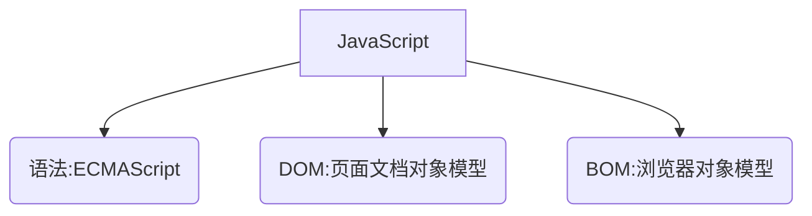

## 一.JS概述
js是一种运行在客户端的脚本语言。



## 二.运行和编写JS代码
### 面向浏览器
1.	行内式：在HTML事件中插入单行或少量JS代码
2.	内嵌式 ：将多行JS代码写到 `script` 标签中
3.	从HTML引入外部JS文件 ：`<script>src="my.js"></script>`     适合于JS 代码量比较大的情况     

### 面向Node.js
需要安装 Node.js。
```
node 文件名
```

## 三.简易的输入输出
### 通用环境
> 浏览器环境下，按 `F12` 打开控制台。

| **方法**         | **说明**                       |
| ---------------- | ------------------------------ |
| `console.log(msg)`     | 向控制台记录信息               |
| `console.error(msg)`   | 向控制台记录错误信息 |
| `console.warn(msg)` | 向控制台记录警告信息       |

### 浏览器环境

| **方法**           | **说明**                       |
| ------------------ | ------------------------------ |
| `alert(msg)`       | 浏览器弹出警示框               |
| `prompt(info)`     | 浏览器弹出输入框，用户可以输入 |

## 四.变量与常量
js是一种弱类型语言，不用提前声明变量的类型，在程序运行过程中，类型会被自动确定。

### 变量
使用 `var` 关键字声明一个变量。

变量名规则：
+	英文、数字、$和\_的组合
+	不能用数字开头
+	不能是JavaScript的关键字
+	区分大小写

<!-- tabs:start -->
#### **代码**
```js
 //声明一个名为age的变量 
 var age;
// 给 age 变量赋值为 20   
 age = 20; 
// 声明一个变量并赋值，称之为变量的初始化
 var age = 88;  
```
<!-- tabs:end -->

### [ES6] `const` 关键字

使用 `const` 关键字声明一个常量。

<!-- tabs:start -->
#### **代码**
```js
const age = 88;  
```
<!-- tabs:end -->

### [ES6] `let` 关键字
使用 `let` 关键字声明一个变量

<!-- tabs:start -->
#### **代码**
```js
let age = 18;
```
<!-- tabs:end -->

### 变量的作用域
1.	用 `var` 声明的变量，只有局部作用域（函数内部）和全局作用域，但没有块作用域：

<!-- tabs:start -->
#### **代码**
```js
function f() {
    for (var i=0; i<100; i++) {
        //code here
    }
    i += 100; // 仍然可以引用变量i
}
```
<!-- tabs:end -->

2.	用 `let` 和 `const` 声明的变(常)量，具有块作用域、局部作用域（函数内部）和全局作用域：

	> 实际上，`let` 关键字的出现就是为了解决块作用域的问题。
	

<!-- tabs:start -->
#### **代码**
```js
function f() {
    for (let i=0; i<100; i++) {
        //code here
    }
    i += 100; // 这里会报错
}
```
<!-- tabs:end -->

3.	在非严格模式下，不使用 `var` `let` `const` 声明的变量默认为全局变量。

### [ES6]解构赋值
解构赋值可以对同一组变量进行赋值，简化语法。

1.	解构赋值比传统赋值的语法更简洁
	
	!> 解构数组时，变量名的顺序决定了对应下标

<!-- tabs:start -->
#### **传统赋值**
```js
var arr = [1,2,3]
var a = arr[0]
var b = arr[1]
var c = arr[2]
```
#### **解构赋值**
```js
var arr = [1,2,3]
var [a,b,c] = arr
```
<!-- tabs:end -->

2.	解构赋值支持嵌套

<!-- tabs:start -->
#### **含嵌套的解构赋值**
```js
var arr = [1,[2,3]]
var [a,[b,c]] = arr
```
<!-- tabs:end -->

3.	解构赋值可以忽略某些元素

<!-- tabs:start -->
#### **忽略前面的元素**
```js
var arr = [1,2,3,4]
var [,,a,b] = arr
console.log(a)
console.log(b)
```
#### **忽略后面的元素**
```js
var arr = [1,2,3,4]
var [a,b] = arr
console.log(a)
console.log(b)
```
<!-- tabs:end -->

4.	解构赋值可以从对象取出属性，同样支持嵌套。
	
	!> 解构对象时，变量名必须和相应的属性名一致

<!-- tabs:start -->
#### **解构对象的属性**
```js
var {name,value} = {name:'hi',value:20,id:3}
console.log(name)
console.log(value)
```
<!-- tabs:end -->

## 五.语句
JavaScript的语法和C语言类似，每个语句以`;`结束，语句块用`{...}`。但是，`JavaScript`并不强制要求在每个语句的结尾加`;`，浏览器中负责执行`JavaScript`代码的引擎会自动在每个语句的结尾补上`;`。

### `if` 语句
其语法和C语言是一样的。

### `switch` 语句
其语法和C语言是基本一样的。但`js`可以将任意类型的变量和常量作为条件， `case`后面也可以接变量。

### `while`、`do-while`、`for` 语句
其语法和C语言也是一样的。

### `for-in`语句
1.	用途:
	+	遍历对象的属性名称
	+	**遍历数组的下标**

2.	格式 `for(var i in 数组/对象) 语句`

<!-- tabs:start -->

#### **代码**
```js
for(var i in [1,2,3]) console.log(i)
```
#### **运行结果**
```js
0
1
2
```
<!-- tabs:end -->

> 一个数组实际上也是一个对象，它的每个元素的索引被视为一个属性。用户在数组对象加上的属性会被遍历出来，但内置的 `length` 属性不会遍历出来。

### [ES6]`for-of`语句
1.	用途
   +	**遍历可迭代对象（数组、`Map`、`Set`）的值**

2.	格式 `for(var i of 对象) 语句`

<!-- tabs:start -->
#### **代码**
```js
for(var i of [1,2,3]) console.log(i)
```
#### **运行结果**
```js
1
2
3
```
<!-- tabs:end -->