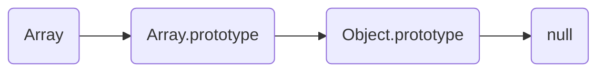

## 一.Array

`Array`可以包含任意数据类型，并通过索引来访问每个元素。

### 数组是一种对象
1.	数组实际上也是对象：
```js
[] instanceof Object //true
typeof [] //'object'
```

2.	数组的原型继承链：



### 创建数组的方法
1.	使用`[]`语法：`var arr = [1,2,3,4,"hi"]`
2.	使用 `new`语法： `var arr = new Array(1,2,3,4)`

!> 对于`Number`、`Boolean` 和 `string`， 直接使用字面量和 `new` 得到的数据类型是不一样的。其中前者为原始类型，后者为对象。但对于数组，这两种方法得到的都是对象。

!> 当使用 `new` 语法时，只传入一个参数，会被函数当做数组的大小。

### 常用数组操作
#### 获取长度
通过 `arr.length` 属性获取。

!> 修改 `arr.length` 的值会导致数组长度的变化。

#### 访问元素
通过 `arr[index]` 来访问元素。

当访问不存在的元素时，会得到 `undefined`。

#### 添加元素

|方法|说明|
|----|----|
|`arr[i] = val`|在任意位置添加元素。|
|`arr.push(val1,val2,...)`|向数组末尾追加多个元素。|
|`arr.unshift(val1,val2,...)`|向数组开头追加多个元素。|

#### 删除元素

|方法|说明|
|----|----|
|`delete a[i]`|删除任意位置的元素。**这不会导致其他元素位置的改变，也不影响数组长度。**|
|`arr.pop()`|删除并返回最后一个元素。|
|`arr.shift()`|删除并返回第一个元素。|

#### 替换元素

|方法|说明|
|----|----|
|`arr.splice(index,num,val1,val2,val3,...)`|将 `index` 开始，`num`个数目的值替换成 `val1,val2,...`。返回被删除的值构成的数组。|

#### 查找元素
|方法|说明|
|----|----|
|`arr.indexOf(val)`|查找一个值第一次出现的位置。|

#### 切片

|方法|说明|
|----|----|
|`arr.slice(start,end)`|返回由`start`开始，`end`结束（不包含）元素构成的数组。支持负索引。|

#### 转换成字符串

|方法|说明|
|----|----|
|`arr.toString()`|将数组转换成字符串，中间用 `,`间隔。|
|`arr.join(divider)`|将数组转换成字符串，中间用 `divider` 间隔。|

#### 颠倒顺序
|方法|说明|
|----|----|
|`arr.reverse()`|将数组反转。|

#### 连接
|方法|说明|
|----|----|
|`arr.concat(arr1,arr2,...)`|将几个数组连接到原数组后面，**并返回新的 `array`**。|

#### 排序
方法：`arr.sort(func)`

默认会将数组转换成字符串，再按字符编码进行升序排序。对于 `Number` 数组往往会出现问题：
```js
[19,17,15,13,11,9,7,5,3,1].sort()//返回(10) [1, 11, 13, 15, 17, 19, 3, 5, 7, 9]
```


其中 `func` 传入 `a` 和 `b`。若：
+	返回负数： `a` 在 `b` 前
+	返回正数： `b` 在 `a` 前
+	返回0： `a` 和 `b` 不作交换

### 数组遍历
#### for-in 循环

`for-in` 循环会遍历数组的下标。

<!-- tabs:start -->

#### **代码**

```js
for (let i in [1,2,3,4,5]) console.log(i)
```

#### **运行结果**

```js
0
1
2
3
4
```
<!-- tabs:end -->


#### for-of 循环
`for-of` 循环会遍历数组的值。

<!-- tabs:start -->

#### **代码**

```js
for (let val of [1,2,3,4,5]) console.log(val)
```

#### **运行结果**

```js
1
2
3
4
5
```
<!-- tabs:end -->

#### map 方法
`map` 方法创建一个新数组，其结果是该数组中的每个元素是调用一次提供的函数后的返回值。

传入函数的参数为 `currentValue`(当前值)、`index`(索引)、`array`(整个数组)。

<!-- tabs:start -->

#### **代码**
对所有数进行平方：
```js
[1,2,3,4,5,6].map(x => x * x)
```

#### **运行结果**

```js
(6) [1, 4, 9, 16, 25, 36]
```
<!-- tabs:end -->

#### reduce 方法
1.	`reduce`和 `reduceRight` 方法对数组中的每个元素执行一个函数，将结果汇总为单个返回值。
2.	其中`reduce`从左边开始累计，`reduceRight`从右边开始累计。
3.	`reduce`和 `reduceRight` 方法有两个参数，`reducer`(执行的函数)和 `initVal`(初始值，可选)。当第二个参数未指定时，`reducer`第一次执行的前两个参数为数组的前两个值（函数执行 `n-1`次）。

`reducer`函数有四个参数：
+	Accumulator (acc) (累计器)
+	Current Value (cur) (当前值)
+	Current Index (idx) (当前索引)
+	Source Array (src) (源数组)


<!-- tabs:start -->

#### **代码**
对所有数进行累加：
```js
[1,2,3,4,5].reduce((x,y) => x+y)
```

#### **运行结果**

```js
15
```
<!-- tabs:end -->

#### filter 方法
`filter`方法传入一个函数，返回函数值为 `true` 时的元素构成的数组。传入函数的参数为 `currentValue`(当前值)、`index`(索引)、`array`(整个数组)。

<!-- tabs:start -->

#### **代码**
筛选出 `x > 2` 的元素：
```js
[1,2,3,4,5].filter((x) => x > 2)
```

#### **运行结果**

```js
(3) [3, 4, 5]
```
<!-- tabs:end -->


#### find 方法
`find`方法传入一个函数，返回函数值为 `true` 时的第一个元素（且不会继续执行函数）。传入函数的参数为 `currentValue`(当前值)、`index`(索引)、`array`(整个数组)。找不到元素时返回 `undefined`。

<!-- tabs:start -->

#### **代码**
找到满足 `x > 2` 的第一个元素：
```js
[1,2,3,4,5].find((x) => x > 2)
```

#### **运行结果**

```js
3
```
<!-- tabs:end -->

#### every 方法
`every`方法检验一个数组的所有元素是否满足条件。若满足则返回 `true`，否则返回 `false`。它传入一个函数，参数为 `currentValue`(当前值)、`index`(索引)、`array`(整个数组)。找不到元素时返回 `undefined`。

<!-- tabs:start -->

#### **代码**
```js
[1,2,3,4,5].every((x) => x > 2)
```

#### **运行结果**

```js
false
```
<!-- tabs:end -->


### [ES6]数组迭代
#### keys方法
返回所有下标构成的迭代器，且包括值为 `undefined`的中间下标。

```js
var iterator = [1,2,3,4,5].keys()
iterator.next(); /*{ value: "0", done: false }*/
iterator.next(); /*{ value: "1", done: false }*/
iterator.next(); /*{ value: "2", done: false }*/
iterator.next(); /*{ value: "3", done: false }*/
iterator.next(); /*{ value: "4", done: false }*/
iterator.next(); /*{ value: undefined, done: true }*/
```
`iterator` 可以使用 `for-of` 循环，也可以使用 `iterator.next()`方法进行迭代。

#### values方法
返回所有值构成的迭代器。
```js
var iterator = [1,2,3,4,5].values()
iterator.next(); /*{ value: "1", done: false }*/
iterator.next(); /*{ value: "2", done: false }*/
iterator.next(); /*{ value: "3", done: false }*/
iterator.next(); /*{ value: "4", done: false }*/
iterator.next(); /*{ value: "5", done: false }*/
iterator.next(); /*{ value: undefined, done: true }*/
```
`iterator` 可以使用 `for-of` 循环，也可以使用 `iterator.next()`方法进行迭代。

## 二.Object
JavaScript的对象是一种 **无序的集合数据类型**，它由若干 **键值对** 组成。其中，值可以是任意类型，但键只能是**字符串**和 **Symbol**。

### 定义一个对象
1.	使用`{}`语法：`var obj = {a:1,b:2}`
2.	使用 `new`语法： `var obj = new Object({a:1,b:2})`

注意事项：
1.	定义对象时，若键 *key* 有特殊字符，则需要用 `''` 括起来：

```js
var obj = {'a-b':1}
```

2.	当定义对象时，后面有重复的属性，则会覆盖前面的属性。

3.	[ES6] 属性的简洁表示法：可以在大括号里面，直接写入变量和函数，作为对象的属性和方法。这样的书写更加简洁。
	!> 简写的对象方法，不能当作构造函数使用。

```js
let a = 1
let b = {a} // 相当于 let b = {a:a}
let c = {
	f() //直接定义函数
	{
		return 2233;
	}
}
```

### 常用对象操作
#### 操作数据
通过 `.` 或 `['']` 的方式来访问或修改对象（当属性不存在时，会自动创建）：
```js
a.b
a['b']
```

!> 如果键 *key* 有特殊字符，则只能通过`['']` 的方式来访问对象。

#### 判断对象是否具有某些属性
使用 `in` 操作符。
```js
'b' in a //true
```

### 对象遍历与迭代
#### for-in循环
for-in循环会遍历对象的所有属性。
#### Object.keys方法
一个表示给定对象的所有可枚举键的数组。

```js
Object.keys([1,2,3,4,5]) //['0', '1', '2']
Object.keys({a:1,b:2}) //["a", "b"]
```

#### Object.values方法
返回一个表示给定对象的所有值的数组。

```js
Object.values([1,2,3,4,5]) //[1,2,3,4,5]
Object.values({a:1,b:2}) //[1, 2]
```

## [ES6]三.Map
`Map`是一组键值对的结构，具有极快的查找速度。

### `Map`和 `Object` 的主要区别
|比较|`Map`|`Object`|
|----|----|----|
|键的类型|任意值|字符串或**Symbol**|
|顺序|有序|无序|
|大小|可直接获取|手动计算|

### 定义 `Map`
`Map` 的定义只能使用`new`：

```js
var m1 = new Map() //无定义
var m2 = new Map([['a',0],['b',1]]) //使用二维数组定义
```
### Map的长度
使用 `map.size` 属性获取。

### 常用操作

|方法|说明|
|----|----|
|`map.get(key)`|获取数据。|
|`map.set(key,value)`|新增或修改数据。|
|`map.clear()`|清空数据。|
|`map.has(key)`|是否包含相应键对应的值。|

### Map遍历与迭代
#### for-of 循环
会以 `[key,value]` 的形式进行迭代。

<!-- tabs:start -->

#### **代码**

```js
var map = new Map([['a',1],['b',2]])
for(let val of map) console.log(val)
```

#### **运行结果**

```js
(2) ["a", 1]
(2) ["b", 2]
```
<!-- tabs:end -->

#### keys 方法
返回包含所有键的迭代器。

<!-- tabs:start -->

#### **代码**

```js
var map = new Map([['a',1],['b',2]])
for(let val of map.keys()) console.log(val)
```

#### **运行结果**

```js
a
b
```
<!-- tabs:end -->

#### values 方法
返回包含所有值的迭代器。

<!-- tabs:start -->

#### **代码**

```js
var map = new Map([['a',1],['b',2]])
for(let val of map.values()) console.log(val)
```

#### **运行结果**

```js
1
2
```
<!-- tabs:end -->


## [ES6]四.Set
`Set`是一组键的集合，但相邻两个键不能重复。

> Set 通常用于过滤重复元素

### 定义 `Set`
`Map` 的定义只能使用`new`：

```js
var m1 = new Set() //无定义
var m2 = new Set([1,2,3]) //使用一维数组定义，重复的元素会被过滤
```
### Set的长度
使用 `set.size` 属性获取。

### 常用方法

|方法|说明|
|----|----|
|`set.add(key)`|添加`key`。|
|`set.delete(key)`|删除`key`。|
|`set.clear()`|删除所有`key`。|
|`set.has(key)`|判断是否有`key`。|

### Set遍历与迭代
#### for-of 循环
会以值的形式进行迭代。

<!-- tabs:start -->

#### **代码**

```js
var set = new Set([1,2,3,4])
for(let val of set) console.log(val)
```

#### **运行结果**

```js
1
2
3
4
```
<!-- tabs:end -->

#### values 方法
返回包含所有值的迭代器。

<!-- tabs:start -->

#### **代码**

```js
var set = new Set([1,2,3,4])
for(let val of set.values()) console.log(val)
```

#### **运行结果**

```js
1
2
3
4
```
<!-- tabs:end -->

## [ES6]五.数组和对象的高级操作
### 拓展运算符
#### 字符串和数组的的拓展运算符
字符串和数组的的拓展运算符 `...` 用于取出数组的所有值，拷贝到另一个数组或函数参数列表中。

1.	运用：
	+	数组复制、合并、追加元素
	+	函数调用
	+	字符串转数组
	+	可迭代对象和迭代器转数组

<!-- tabs:start -->

#### **函数调用**

```js
console.log(...[1, 2, 3])
console.log(1, ...[2, 3, 4], 5)
f(1,2,3,...[1,2,3,4,5,6])
```

#### **数组复制**

```js
var a = [1,2,3,4,5]
var b = [...a]
a === b //false
```

#### **字符串转数组**

```js
[...'hello'] // [ "h", "e", "l", "l", "o" ]
```

#### **可迭代对象转数组**

```js
let map = new Map([
  [1, 'one'],
  [2, 'two'],
  [3, 'three'],
]);
let arr = [...map] // (3) [Array(2), Array(2), Array(2)]
arr = [...map.keys()] //(3) [1, 2, 3]
```

<!-- tabs:end -->

2.	数组的拓展运算符只会将元素进行浅拷贝。

```js
var a = [{a:1},{a:2}]
var b = [...a]
b[0] === a[0] //true
```

#### 对象的拓展运算符

对象的扩展运算符`...`用于取出参数对象中的所有可遍历属性，拷贝到当前对象之中。

1.	运用：
	+	对象复制、合并、追加属性

```js
var o1 = {a:1,b:2}
var o2 = {...o1}
```

### 解构赋值
解构赋值可以对同一组变量进行赋值，简化语法。

1.	解构赋值比传统赋值的语法更简洁
	
	!> 解构数组时，变量名的顺序决定了对应下标

<!-- tabs:start -->
#### **传统赋值**
```js
var arr = [1,2,3]
var a = arr[0]
var b = arr[1]
var c = arr[2]
```
#### **解构赋值**
```js
var arr = [1,2,3]
var [a,b,c] = arr
```
<!-- tabs:end -->

2.	解构赋值支持嵌套

<!-- tabs:start -->
#### **含嵌套的解构赋值**
```js
var arr = [1,[2,3]]
var [a,[b,c]] = arr
```
<!-- tabs:end -->

3.	解构赋值可以忽略某些元素

<!-- tabs:start -->
#### **忽略前面的元素**
```js
var arr = [1,2,3,4]
var [,,a,b] = arr
console.log(a)
console.log(b)
```
#### **忽略后面的元素**
```js
var arr = [1,2,3,4]
var [a,b] = arr
console.log(a)
console.log(b)
```
<!-- tabs:end -->

4.	解构赋值可以从对象取出属性，同样支持嵌套。
	
	!> 解构对象时，变量名必须和相应的属性名一致

<!-- tabs:start -->
#### **解构对象的属性**
```js
var {name,value} = {name:'hi',value:20,id:3}
console.log(name)
console.log(value)
```
<!-- tabs:end -->

5.	解构赋值可以为对象的属性定义别名

<!-- tabs:start -->
#### **定义别名**
```js
var {name,value:val} = {name:'hi',value:20,id:3}
console.log(name)
console.log(val)
```
<!-- tabs:end -->

6.	解构赋值可以定义默认值。当传入的属性不存在时，便会使用默认值。

<!-- tabs:start -->
#### **默认值**
```js
var {name,single:true} = {name:'hi',value:20,id:3}
console.log(name)
console.log(single)
```
<!-- tabs:end -->

7.	字符串的解构赋值：会被转换换成类似数组的对象

```js
var [a,b] = "hello"
a //h
b //e
```

8.	`number` 和 `boolean`的解构赋值：先转换成对象，再进行解构赋值

```js
var {toString} = 123;
toString == Number.prototype.toString //true
```

9.	函数参数的解构赋值：将参数分解为变量

<!-- tabs:start -->
#### **默认值在解构内**
如果解构失败，`x`和`y`等于默认值。
```js
function f({x = 0, y = 0} = {}) {
  return [x, y];
}

f({x: 2, y: 3}); // [2, 3]
f({x: 2}); // [2, 0]
f({}); // [0, 0]
f(); // [0, 0]
```
#### **默认值在解构外**
下面代码是为函数 `move` 的参数指定默认值，而不是为变量 `x` 和 `y` 指定默认值。当参数为 `{}` 时，默认值不生效，相应值为 `undefined`。
```js
function f({x, y} = { x: 0, y: 0 }) {
  return [x, y];
}

f({x: 2, y: 3}); // [2, 3]
f({x: 2}); // [2, undefined]
f({}); // [undefined, undefined]
f(); // [0, 0]
```
<!-- tabs:end -->

10.	使用已声明的变量进行解构赋值时，需要将整条语句用 `()` 括起来，否则`JavaScript`引擎会将解构赋值当做块作用域的开头处理。

<!-- tabs:start -->

#### **错误**
```js
var x, y
{x, y} = { x: 22, y: 33} //Uncaught SyntaxError: Unexpected token =
```

#### **正确**
```js
var x, y
({x, y} = { x: 22, y: 33}) //Uncaught SyntaxError: Unexpected token =
```

<!-- tabs:end -->

11.	解构赋值的应用

<!-- tabs:start -->
#### **从函数返回多个值**
```js
function f()
{
	return [1,2,3]
}
var [a,b,c] = f()
```

#### **函数参数的定义**
```js
function f1([a,b,c]) {} //定义有序参数
function f2({a,b,c}) {} //定义无序参数
```

#### **从对象中提取值**
```js
let {id,name} = {id:1,name:"Kaz",age:18}
```

#### **遍历 Map**
```js
let map = new Map()
map.set('a', 1)
map.set('b', 2)
for (let [key, value] of map) {
  console.log(key + " is " + value);
}
```

#### **模块选择性引入**
```js
const { a, b } = require("test")
```
<!-- tabs:end -->

## [ES6]六.迭代器

### 概念

`Iterator`是一种接口，为各种不同的数据结构提供统一的访问机制。任何数据结构只要部署 `Iterator` 接口，就可以完成遍历操作。

所有具有`Iterator` 接口的对象都可以通过 `for-of` 进行遍历。

### 内置 `Iterator` 接口的对象

!> `Object` 不一定具有 `Iterator` 接口。

+	`Array`
+	`Map`
+	`Set`
+	`String`
+	函数的`arguments`
+	`NodeList`

### 默认的 `Iterator` 接口
1.	默认的 `Iterator` 接口部署在数据结构的 `Symbol.iterator` 属性。只要一个数据结构只要具有 `Symbol.iterator` 属性，就可以认为是可遍历的`iterable`。

2.	`Symbol.iterator` 属性是一个函数，返回一个遍历器对象，其根本特征就是具有 `next` 方法，其中 `next` 方法返回当前值 `value` 和是否完成 `done` 构成的对象。

```js
//定义一个可迭代的对象
let a = {
	[Symbol.iterator]() {
		let i = 0
		return {
			next:function(){
				return {
					value: ++i,
					done: i > 100
				}
			}
		}
	}
}

for(v of a) console.log(v) //输出前100个值
```

### 调用`Iterator` 接口的场合
1.	解构赋值
2.	拓展运算符
3.	`yield*` 后面跟的是一个可遍历的结构，它会调用该结构的遍历器接口。
4.	`for-of`
5.	`Array.form`:可迭代对象转数组

```js
Array.from(a)
```

参考：

阮一峰ES6教程 —— https://es6.ruanyifeng.com/#docs/destructuring 、https://es6.ruanyifeng.com/#docs/iterator

廖雪峰的官方网站——https://www.liaoxuefeng.com/wiki/1022910821149312/1023021187855808