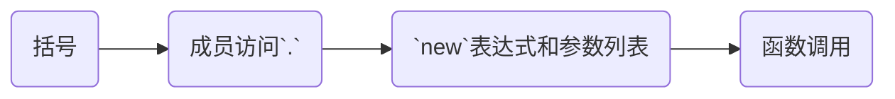
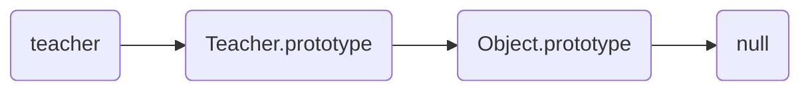
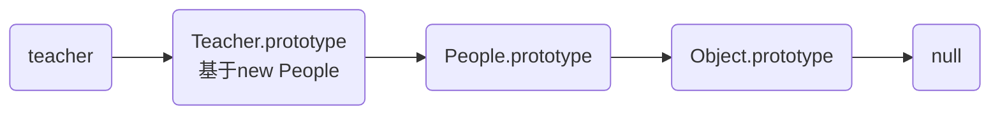
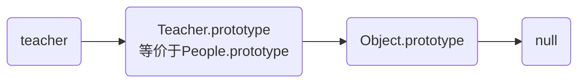

## 一.基本概念
1. 类：类是对象的类型模板
2. 实例：实例是根据类创建的对象。分为属性和方法。
3. `JavaScript` 不区分类和实例的概念，通过 **原型**和**原型链**来实现对象模型。
4. 封装：将有关的数据和操作代码封装在一个对象中,形成一个基本单位，各个对象之间相对独立,互不干扰。
5. 信息隐蔽：隐蔽对象其内部细节，只留下少数接口，以便与外界联系，接收外界的消息。
6. 继承：共性与个性产生了继承机制，即允许子类共享父类的数据和操作的继承机制，这样可以实现**软件重用**。
7. 多态性：由继承而产生的相关的不同的类,其对象对同一消息会作出不同的响应。

封装主要涉及对象的创建、属性两部分。
其中，`二~五`探讨的是使用构造函数而非 `class`关键字 创建的对象，而`六` 探讨的是通过 `class` 关键字创建的类和对象。

## 二.对象的创建
### 创建对象的方式
1.	手动创建对象
2.	使用函数创建对象
3.	使用构造函数创建对象
4.	使用原型

#### 手动创建对象
缺点：麻烦、缺少联系
```js
var teacher = {
	name: '',
	age: 0
}

var teacher1 = {
	name: 'a',
	age: 22
}

var teacher2 = {
	name: 'a',
	age: 33
}
```

#### 使用函数创建对象
缺点：依然缺少联系，不能反映其原型
```js
function Teacher(name,age)
{
	return {name,age}
}
var teacher1 = Teacher('a',22)
var teacher2 = Teacher('a',33)
```

#### 使用构造函数创建对象
缺点：有重复的方法，浪费内存
```js
function Teacher(name,age)
{
	this.name = name
	this.color = color
	this.work = function(){console.log("工作")}
}

var teacher1 = new Teacher('a',22)
var teacher2 = new Teacher('a',33)

teacher1 instanceof Teacher //true
teacher2 instanceof Teacher //true
teacher1.work === teacher2.work //false 两个不同的函数实例，模式相同，却占用两份空间
```

#### 使用原型
每一个构造函数都有一个 `prototype` 属性，指向另一个对象。这个对象的所有属性和方法，都会被构造函数的实例继承。

`prototype` 在对象构造时不会拷贝到对象中。当属性不在自身时，会返回原型中的属性。这意味着原型中的属性是所有同类对象共享的（这类似于静态成员）。

```js
function Teacher(name,age)
{
	this.name = name
	this.color = color
}

Teacher.prototype.work = function(){console.log("工作")}

var teacher1 = new Teacher('a',22)
var teacher2 = new Teacher('a',33)

teacher1 instanceof Teacher //true
teacher2 instanceof Teacher //true
teacher1.work === teacher2.work //true 两个相同的函数实例
```

### 验证原型
#### instanceof
判断对象的原型链中是否有某个构造函数：
```js
teacher1 instanceof Teacher //true
teacher1 instanceof Object //true
```
#### isProptotypeOf
判断对象的原型链中是否有某个原型：
```js
Teacher.prototype.isProptotypeOf(teacher1) //true
```
#### hasOwnProperty
判断对象的某个属性是自身的还是继承的：
```js
teacher1.hasOwnProperty("name") //true
teacher1.hasOwnProperty("work") //false
```
#### in 运算符
判断某个对象是否有某个属性，无论是否是继承的：
```js
"work" in teacher1 //true
```

### new 的细节
#### new 的实现
```js
function myNew(Con,args)
{
	var obj = Object.create(Con.prototype) //依照原型创建一个空对象
	var res = Con.apply(obj,args) //调用构造函数
	
	//可选，若用户返回对象，则直接用用户返回的对象
	if(typeof res === 'object') 
		return res 
    else 
    	return obj 
}
```
#### new 与括号
1.	`new` 会与第一个参数列表结合
2.	优先级顺序：



```js
new Date //相当于 new Date()

new Date(args1).getTime(args2)
/* 相当于
 let d = new Date(args1)
 d.getTime(args2)
 */

new Date.getTime(args) 
/* 相当于
 let f = Date.getTime
 new f(args)
 */
```
## 三.对象的属性
对象的属性分为**数据属性**和**访问器属性**。

### 计算属性
创建一个对象时，可以在属性字面量中使用方括号，来实现动态获取的属性值。
```js
let prop = "hello"
let obj = {
	[prop]: 23333
}
```


### 私有属性
`JavaScript` 原生不支持私有属性，可通过以下方法代替实现：

1.	约定俗成
2.	函数作用域
3.	`Proxy`拦截私有属性

#### 约定俗成


即在属性名称前加上 `_`以示区分。但这只能通过命名规范来约定，不能靠运行时的检查来约定。

#### 函数作用域

函数作用域使得函数内部的变量不能随意被外部访问：

```js
//创建不带构造函数的对象
function createObj()
{
    let private = 0;
    return {
        public: 1,
        getPrivate() {
        	return private
        }
    }
}

let demo1 = createObj()

//创建带构造函数的对象

function People(name,age)
{
	this.getName = function(){
		return name
	}
	this.getAge = function(){
		return age
	}
}
let demo2 = new People('kaz','18')
```
函数作用域可以结合 `Symbol` 或 `Map` 使用：
```js
let People = ( function() {
	let nameSymbol = Symbol('name')
	let ageSymbol = Symbol('age')
	return function(name,age) {
		this[nameSymbol] = name
		this[ageSymbol] = age
		this.getName = function(){
			return this[nameSymbol]
		}
		this.getAge = function(){
			return this[ageSymbol]
		}
	}
} )()
```

#### [ES6] `Proxy`拦截属性
在构造函数中返回对象的 `Proxy` ，使得对象外面无法访问以 `_` 开头的属性。

```js
function Person(name,age)
{
	this._name = name;
	this._age = age;
	this.getName = function(){
		return this._name;
	}
	return new Proxy(this, {
      get: (target, prop) => {
        if (prop.toString().indexOf('_') === 0) {
          throw new TypeError('无法访问私有属性');
        }
        
        //如果是公有方法，则绕过 Proxy的类型检查，避免公有方法被拦截
        if(target[prop] instanceof Function)
        	return target[prop].bind(this)
        return target[prop];
      },
      set: (target, prop, value) => {
        if (prop.toString().indexOf('_') === 0) {
          throw new TypeError('无法访问私有属性');
        }
        target[prop] = value;
      }
    });
}

let p = new Person('kaz',18)
p.getName() // 'kaz'
p._name //error
```

### 静态属性
1.	在构造函数名上添加的属性，称为 **静态属性**。
2.	静态属性不可以访问对象中的属性和方法。
3.	静态属性只能通过构造函数名访问，不能通过对象访问。

### 访问器属性
#### 概念和使用
1.	访问器属性用于获取和设置值的函数，但从外部代码来看就像常规属性。
2.	访问器属性有 `get` 和 `set`两种。
3.	当访问器属性只设置 `get` 时，访问器属性不可写。
4.	常见用途：监听属性的修改；对输入的属性进行验证；对需要读取的属性进行修饰。
	

```js
//既有 get 又有 set
let u1 = {
	_name :"kaz",
	_age: "18"
	get name() {
		console.log("get user")
		return this._name
	}
	set name(value) {
		console.log("set user")
		this._name = value
	}
}
console.log(u1.name) //"kaz"
u1.name ="kaz" //ok

//只有 get

let u2 = {
	_name :"kaz",
	_age: "18",
	get name() {
		console.log("get user")
		return this._name
	}
}

console.log(u2.name) //"kaz"
u2.name ="guapi"  //不会报错，但不会影响原有数据。
```

#### 局限性
1.	`set` 的深度是有限的，不能监听数组和对象类型的内部变化：

```js
let u = {
	name: "kaz",
	_tags: ["mc","js","vue"],
	get tags()
	{
		console.log("getter")
		return this._tags
	},
	set tags(val)
	{
		console.log("commit")
		this._tags = val
	}
}

u.tags[3] = "cpp" // 只触发了 getter，但没有触发修改器
```

2.	如果需要监听所有属性的变化，则需要对所有属性进行遍历。而且不能监听属性的添加和删除。

	不同的工具和框架给出了不同的方案：
	+	Vue2：
		1.	通过访问器属性监听对象属性的变化。
		2.	不监听数组直接赋值(如 `vm.a[0] = 1`)引起的变化（可以实现，但官方考虑到性能问题，没有应用到框架中）。
		3.	改写数组的方法。
		4.	通过 `vm.$set` 实现属性增删的更新。
		5.	不允许在根节点上增加属性。（因为监听不了）
	+	微信小程序：通过统一的接口 `setData` 来触发属性的变化。
	+	Vue3：使用 `Proxy`，避免了这些问题。
		1.	直接代理对象，避免所有属性的遍历。
		2.	不局限于`set` 和 `get`，支持对象的多种行为。


### 属性描述符
#### 概念
1.	对象里目前存在的属性描述符有两种主要形式：数据描述符和存取描述符。
2.	数据描述符是一个具有值的属性，该值可以是可写的，也可以是不可写的。
3.	存取描述符是由 `getter` 函数和 `setter` 函数所描述的属性。
4.	**一个描述符只能是这两者其中之一；不能同时是两者。**
5.	属性的描述符一共有六个：
	- `value` ：属性的值
	- `get` ：获取器
	- `set` ：修改器
	- `writable`：如果为 `true`，则值可以被修改，否则它是只可读的。
	- `enumerable` ：如果为 `true`，则会被在循环中列出，否则不会被列出。
	- `configurable`：如果为 `true`，则此属性可以被删除或属性描述也可以被修改，否则不可以。

6.	不同的描述符可拥有的键值：

| 类型   | `configurable` | `enumerable` | `value` | `writable` | `get`  | `set`  |
| -------------- | ------------ | ------- | ---------- | ------ | ------ | ------ |
| 数据描述符     | 可以         | 可以    | 可以       | 可以   | 不可以 | 不可以 |
| 存取描述符     | 可以         | 可以    | 不可以     | 不可以 | 可以   | 可以   |

7.	属性描述的默认值
	+	拥有布尔值的键 `configurable`、`enumerable` 和 `writable` 的默认值都是 `false`。
	+	属性值和函数的键 `value`、`get` 和 `set` 字段的默认值为 `undefined`。

#### 获取属性的标志


## 四.继承
### 构造函数的继承
一共有五种继承方式：
1.	构造函数绑定
2.	直接修改 Prototype
3.	直接继承 Prototype
4.	空对象中介
5.	拷贝继承

#### 构造函数绑定
在构造函数中通过`call`和`apply`调用父构造函数。

缺点：
+	仅仅将对象自有的属性进行复制，其父对象的原型并没有被继承。
+	没有很好地体现出继承关系

```js
function People(name,age)
{
	this.name = name
	this.age = age
}
People.prototype.sleep = function(){console.log("sleep")}

function Teacher(name,age,subject)
{
	People.apply(this,arguments)
	this.subject = subject
}

Teacher.prototype.work = function(){console.log("work")}

var teacher = new Teacher("Steve",18,"English")
teacher instanceof People //false
teacher.sleep //undefined
```
实际原型链：


#### 直接修改 Prototype
优点：很好地体现出继承关系

缺点：子类原型链上的属性与子对象的属性重复，导致不必要的空间占用（如`Teacher.prototype.name` 和 `teacher.name` 是重复的，应该删掉`Teacher.prototype.name`）

!> 当我们直接修改对象的原型时，务必将 `constructor` 属性指回原构造函数。

```js
function People(name,age)
{
	this.name = name
	this.age = age
}
People.prototype.sleep = function(){console.log("sleep")}

function Teacher(name,age,subject)
{
	People.apply(this,arguments)
	this.subject = subject
}

//修改原型链
Teacher.prototype = new People()
Teacher.prototype.constructor = Teacher //改回构造函数，否则会出现 teacher.constructor == People 的现象，造成混乱
Teacher.prototype.work = function(){console.log("work")}

var teacher = new Teacher("Steve",18,"English")

teacher instanceof People //true
teacher.sleep //ƒ (){console.log("sleep")}
```

实际原型链：

#### 直接继承 Prototype
优点：相比于上面的方法，节省了创建 `People` 对象的内存空间

缺点：对子类原型的修改会反映到父类的原型上

```js
function People(name,age)
{
	this.name = name
	this.age = age
}
People.prototype.sleep = function(){console.log("sleep")}

function Teacher(name,age,subject)
{
	People.apply(this,arguments)
	this.subject = subject
}

//修改原型链
Teacher.prototype = People.prototype
Teacher.prototype.constructor = Teacher //改回构造函数，否则会出现 teacher.constructor == People 的现象，造成混乱
Teacher.prototype.work = function(){console.log("work")}

People.prototype.constructor === Teacher //结果这个也改的
```
实际原型链：


#### 空对象中介
优点：很好地体现出继承关系

缺点：比较复杂

这种方法可以写一个通用的函数用来继承：
```js
function extend(Child,Parent)
{
	var Func = function(){};
	Func.prototype = Parent.prototype;
	
	Child.prototype = new Func();
	Child.prototype.constructor = Child;
}
```

示例：

```js
function People(name,age)
{
	this.name = name
	this.age = age
}
People.prototype.sleep = function(){console.log("sleep")}

function Teacher(name,age,subject)
{
	People.apply(this,arguments)
	this.subject = subject
}

//实现继承
extend(Teacher,People)
```

#### 拷贝继承
把父对象的原型属性拷贝到子对象上。

优点：父对象的原型可以被继承

缺点：没有很好地体现出继承关系

通用函数：
```js
function extend(Child,Parent)
{
　　　　var pp = Parent.prototype
　　　　var cp = Child.prototype
　　　　for (let i in cp) 
　　　　	cp[i] = pp[i]
}
```
示例：
```js
function People(name,age)
{
	this.name = name
	this.age = age
}
People.prototype.sleep = function(){console.log("sleep")}

function Teacher(name,age,subject)
{
	People.apply(this,arguments)
	this.subject = subject
}

//实现继承
extend(Teacher,People)


var t = new Teacher()
t instanceof People //false,没有很好地体现出继承关系
```
### 非构造函数的继承
1.	object() 方法
2.	浅拷贝
3.	深拷贝

#### object() 方法

提出：`json`格式的发明人 `Douglas Crockford`

方法：把子对象的 `prototype` 属性，指向父对象，从而使得子对象与父对象连在一起。

优点：
1.	对同名属性的赋值，会加到子对象中，不会影响父对象。
2.	未重新赋值的同名属性，直接使用父对象的值，节省空间。

缺点：
1.	父对象的修改可能会反映到子对象

```js
function object(o) {
　　function F() {}
　　F.prototype = o;
　　return new F();
}
```
使用：
```js
let b = object(a) //继承
b.xxx = xxx //添加自有属性
```

#### 浅拷贝
优点：
1.	简单粗暴

缺点：

1.	每次创建对象都会把父对象的属性全部复制一遍，有时间开销。
2.	未重新赋值的同名属性，仍然会单独占据空间，有空间开销。
3.	数组和对象类型的修改，会反映到父对象。同理，父对象相应的修改会反映到子对象上。

```js
function object(p) {

　var obj = {};

　for (let i in p) {
　　　obj[i] = obj[i];
　}
　return obj;
}
```

#### 深拷贝
优点：
1.	完全复制，父对象的修改不会反映到子对象

缺点：
1.	每次创建对象都会把父对象的属性全部复制一遍，有时间开销。
2.	未重新赋值的同名属性，仍然会单独占据空间，有空间开销。

```js
function deepCopy(p, c) {
	var c = c || {};
	for (let i in p) {
		if (typeof p[i] === 'object') {
　　　　　　　　c[i] = (p[i].constructor === Array) ? [] : {};
　　　　　　　　deepCopy(p[i], c[i]);
　　　　　　} else {
　　　　　　　　　c[i] = p[i];
　　　　　　}
　　　}
　　　return c;
}
```


## 五.多态性
多态最根本的作用就是通过把过程化的条件分支语句转化为对象的多态性，从而消除这些条件分支语句。

JavaScript 常见实现多态的场景：
1.	覆盖：每个对象创建后可以反复覆盖实例定义的属性方法和原型定义的属性方法。
2.	类接口（`JavaScript` 本身没有接口概念）：函数调用时，不同的对象满足函数要求具有的属性和方法就行，而不必在意它是什么对象。
3.	`JavaScript` 是动态语言，一个对象可以有不同的类型，这意味着 `JavaScript` 对象的多态性是与生俱来的。

## [ES6]六.class 创建对象

## [ES6]七.Proxy


## 参考
1.	阮一峰的网络日志——http://www.ruanyifeng.com/blog/2010/05/object-oriented_javascript_inheritance.html
2.	JavaScript设计模式与开发实践.曾探
3.	深入响应式原理——Vuejs https://cn.vuejs.org/v2/guide/reactivity.html
4.	vue为什么不能检测数组的变化——小丸子的城堡https://www.cnblogs.com/youhong/p/12173354.html
5.	为什么Vue3.0使用Proxy实现数据监听(defineProperty表示不背这个锅)——脚本之家：https://www.jb51.net/article/171869.htm
6.	记一次思否问答的问题思考：Vue为什么不能检测数组变动——segmentfault：https://segmentfault.com/a/1190000015783546
7.	defineProperty——MDN:https://developer.mozilla.org/zh-CN/docs/Web/JavaScript/Reference/Global_Objects/Object/defineProperty


