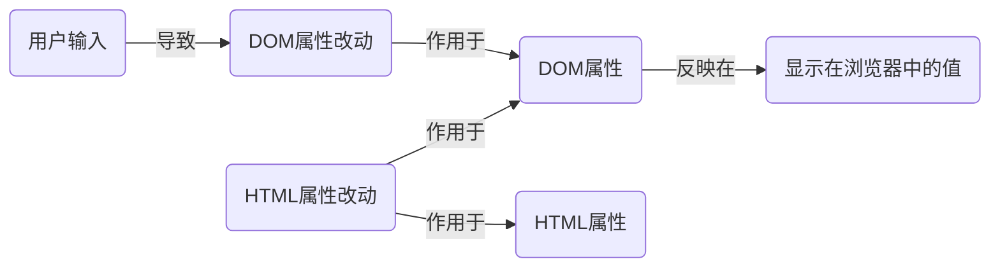

## 一.简单数据绑定
### 1.文本输出：双括号语法
语法：`{{ javascript表达式 }}`

<!-- tabs:start -->
#### **html**
```html
<div id="app">
	<p>{{ name }}</p>
</div>
```
#### **js**
```js
new Vue({
	el:'#app',
	data: {
		name:'Hi',
	}
});
```
<!-- tabs:end -->

### 2.HTML文本输出：v-html指令
语法：`v-html="javascript表达式"`

<!-- tabs:start -->
#### **html**
```html
<div id="app">
	<div v-html="bd"></div>
</div>
```
#### **js**
```js
new Vue({
	el:'#app',
	data: {
		bd:'<a href="https://www.baidu.com">baidu</a>',
	}
});
```
<!-- tabs:end -->

### 3.HTML属性绑定：v-bind
1.	语法：`v-bind:属性="javascript表达式"`，其中`v-bind:`可省略为 `:`。
2.	修饰符：
|修饰符|说明|
|----|----|
|`.sync`|表示子组件想要修改父组件的值，此时表达式只能是一个属性名，类似 `v-model` 。|
|`.prop`|将属性作为DOM property绑定，而不是作为HTML attribute。|

!> 大多数情况下DOM property和HTML attribute是一样的。但对于表单元素的某些可输入属性，如 `value` 若修改 HTML attribute，则 DOM property 也会变化；而修改DOM property，HTML attribute不会变化，这便会导致两个属性的差异。




<!-- tabs:start -->

#### **html**
```html
<div id="app">
	<a v-bind:href="link">{{ name }}</a>
</div>
```
#### **js**
```js
new Vue({
	el:'#app',
	data: {
		name:'baidu',
		link:'https://www.baidu.com',
	}
});
```
<!-- tabs:end -->

### 4.一次性绑定：v-once
只会将最初的数据进行绑定，若数据发生变化，则不进行元素的更新。

<!-- tabs:start -->

#### **html**
```html
<div id="app">
	<a v-bind:href="link">{{ get_name() }}</a>
	<a v-once>{{ name }}</a>
</div>
```
#### **js**
```js
new Vue({
	el:'#app',
	data: {
		name:'baidu',
		link:'https://www.baidu.com',
	},
	methods:{
		get_name:function(){
			this.name = "google";
			return this.name;
		}
	}
});
```
<!-- tabs:end -->

## 二.样式绑定
1.	作用对象： `style` 和 `class` 两个属性
2.	与其他属性的区别：
	+	允许被绑定和未绑定的属性重名。Vue将会将这些属性进行叠加。
	+	支持数组语法和对象语法。

### 1.绑定 class
1.	对象语法：`:class="{类名:是否开启,...}"`
2.	数组语法：`:class="[类名,...]"`
3.	混合语法：`:class="[{类名:是否开启},...]"`

### 2.绑定style
1.	对象语法：`:class="{样式名:值,...}"`
2.	混合语法：
	`:class="[{样式名:值},...]"`

注意：
1.	样式名可以使用驼峰法 `camelCase`，也可以使用带引号的短横线 `'kebab-case'`
2.	值可以是一个数组。Vue只会渲染数组中最后一个被浏览器支持的值。
3.	Vue 会自动为样式添加浏览器前缀

## 三.事件绑定
### 1.v-on
1.	语法： `v-on:事件名="方法名或javascript表达式"`，`v-on:` 可简写成 `@`
2.	参数传递
	+	若直接传递方法名，则方法第一个参数为事件对象
	+	若传递方法名和参数，则可以手动传递事件对象 `$event`

### 2.v-o的修饰符
1.	事件修饰符

|修饰符|说明|
|----|----|
|`.prevent`|阻止浏览器的默认行为。|
|`.stop`|停止事件向下传递。|
|`.capture`|内部元素触发的事件优先处理。|
|`.self`| 事件不会从内部元素触发。|
|`.once`| 事件只触发一次。|
|`.passive`|告诉浏览器你不想阻止事件的默认行为。|
|`.native`|监听组件根节点的原生事件。|

2.	常用键盘按键修饰符

|修饰符|说明|
|----|----|
|`.enter`|键盘 Enter 键|
|`.tab`|键盘 ↓ 键|
|`.delete`|键盘 Delete 键|
|`.esc`| 键盘 Esc 键。|
|`.space`| 键盘 空格 键。|
|`.up`|键盘 ↑ 键。|
|`.down`|键盘 ↓ 键。|
|`.left`|键盘←键。|
|`.right`|键盘→键。|

3.	常用系统修饰按键

|修饰符|说明|
|----|----|
|`.ctrl`|键盘Ctrl键|
|`.alt`|键盘Alt键|
|`.shift`|键盘Shift键|
|`.meta`| Windows徽标键⊞ 或command 键 ⌘|

4.	鼠标修饰按键

|修饰符|说明|
|----|----|
|`.left`|鼠标左键。|
|`.right`|鼠标右键。|
|`.middle`|鼠标中键。|

5.	其他修饰符

|修饰符|说明|
|----|----|
|`.exact`|按键精确匹配。如按下 `Ctrl+Tab`不会匹配`Tab`。|

### 3.程序化的事件监听器
1.	通过 `$on(eventName, eventHandler)` 侦听一个事件
2.	通过 `$once(eventName, eventHandler)` 一次性侦听一个事件
3.	通过 `$off(eventName, eventHandler)` 停止侦听一个事件

## 四.表单输入绑定
1. 	**v-model** 会用Vue对象的数据替代 表单元素的初始值
2. 	默认绑定

| 表单类型       | 绑定属性 | 绑定事件 | 属性类型     |
| -------------- | -------- | -------- | ------------ |
| text           | value    | input    | string       |
| textarea       | value    | input    | string       |
| checkbox(单个) | checked  | change   | bool         |
| checkbox(多个) | value    | change   | string array |
| radio          | value    | change   | string       |
| select(单选)   | value    | change   | string       |
| select(多选)   | value    | change   | string array |

2. **修饰符**

|修饰符|说明|
|----|----|
|`.lazy`|将输入时触发改为内容改变时触发。|
|`.number`|输入结果转换为数据。|
|`.trim`|忽略首尾的空白字符。|