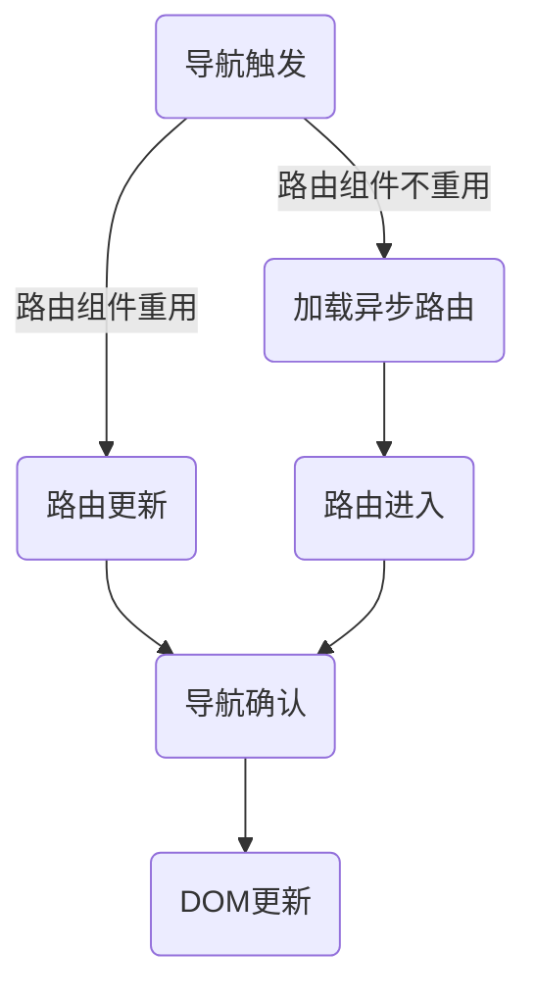
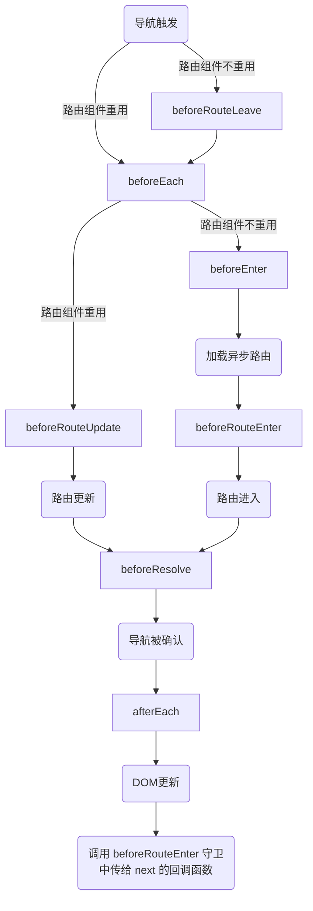

## 一.路由器对象 Router
1.	出现点
	+	构造 `VueRouter` 对象后。
	+	Vue实例内自动注入的对象`$router` 。

2.	路由器对象常用构建选项

|参数|类型|可用值|解释|
|----|----|----|----|
|`routes`|`Array<RouteConfig>`|没有|路由记录的数组。|
|`mode`|`String`|`hash`(默认),`history`,`abstract`(Node环境下默认)|路由模式。`hash`模式路径前回显示一个`#`，`history`不显示，`history`但需要服务器环境的支持。|
|`base`|`String`|任意，默认为`/`|路由根路径。|
|`linkActiveClass`|`String`|任意，默认为`"router-link-active"`|全局配置 `<router-link> `默认的激活的 class。|
|`linkExactActiveClass`|`String`|任意，默认为`"router-link-exact-active"`|全局配置 `<router-link> `默认精确激活的 class。|
|`scrollBehavior`|Function(to: Route, from: Route, savedPosition: {x,y}) => {x,y}|无|(支持 history.pushState 的浏览器中可用)定义滚动行为。|

3.	路由器实例属性

|属性|类型|解释|
|----|----|----|
|`app`|`Vue`|Vue根实例|
|`mode`|`String`|路由模式|
|`currentRoute`|`Route`|当前的路由信息|

4.	常用方法

|方法|解释|
|----|----|
|`router.onReady(callback, [errorCallback])`|路由完成初始导航时调用|
|`router.onError(callback)`|路由出错时调用|
|`router.addRoutes(Array<RouteConfig>)`|动态添加路由|
|`router.resolve(location: Location, current, append: Boolean)`|解析路由，current是当前默认的路由(一般不需要改)，append是否追加路由。返回值：`{location: Location;route: Route;href: string;}`|

## 二.路由器视图 router-view
1.	功能：渲染路径匹配到的视图组件。
2.	参数

|参数|类型|默认值|解释|
|----|----|----|----|
|`name`|`String`|`'default'`|路由器视图名称。当一个组件有多个路由器视图时，需要指定视图的名字。|

其余的参数会自动传递给组件。

## 三.路由记录 RouteConfig
1.	概念：`routes` 配置中的每个路由对象称为 **路由记录**。
2.	每条路由记录对象可用的键：

|`RouteConfig`中的键|类型|解释|示例|
|----|----|----|----|
|`path`（必须）|`String`|路径名称。其中`:name`为 **动态参数**；`*`为通配符|`/user`,`/user/:id`,`*`|
|`alias`|`String,Array<String>`|路径的别名|`"/link"`|
|`name`|`String`|路由的名称|`"info"`|
|`redirect`|`string,Location,Function`|跳转的路径，位置对象，函数（参数为路由对象，返回要重定向的位置：字符串/位置对象）|`"/link"`,`{ name: 'foo' }`|
|`component`|`Component`|一个路由视图下，路由对应的组件|`Foo`|
|`components`|`{String:Component}`|多个路由视图下，不同路由视图对应的组件。匿名视图对应`default`|`{default: Foo, a: Bar}`|
|`children`|`Array<RouteConfig>`|嵌套路由，会渲染父路由对应组件的 `router-view`。如果没有子路径，配置中的`path`可写 `""`|暂无|
|`beforeEnter`|`Function(to,from,next)`|进入路由前的钩子，无返回值||
|`meta`|`Any`|路由元信息||

3.	路由记录匹配规则：
	若同一个路径匹配多个路由，则匹配的优先级就按照路由的定义顺序：先定义的优先级最高。

4.	路径别名和跳转的区别：路径别名不会触发 URI的更新，而路径跳转会触发 URI的更新。

## 四.路由路径 Location
1.	用于 `router-link` 组件中的 `to` 属性的值，以及路由记录中 `redirect` 的值。

常用的键：

|键|类型|解释|
|----|----|----|
|`name`|`String`|路由名称，路由记录中的`name`属性。|
|`path`|`String`|路径名称，如`register` => `/register`。**如果提供了 `path`，`params` 会被忽略。**|
|`params`|`Object`|传入路由中的动态参数。|
|`query`|`Object`|传入路由中的查询信息，如`{id: 2}` => `路径?id=2`。|

## 五.路由信息 Route
1.	出现点
	1.	路由守卫函数的参数 `to` `from`
	2.	Vue实例内自动注入的对象`$route` 。

2.	功能：表示当前路由的信息。

3.	路由信息对象常用键：

|键|类型|解释|
|----|----|----|
|`name`|`String`|路由名称，路由记录中的`name`属性。|
|`redirectedFrom`|`String`|重定向来源路由的名字。|
|`path`|`String`|当前路由的路径。|
|`fullPath`|`String`|完成解析后的 URL，包含查询参数和 hash 的完整路径。|
|`hash`|`String`|当前路由的 hash 值 (带 #) ，如果没有 hash 值，则为空字符串。|
|`params`|`Object`|路由中的动态参数。|
|`query`|`Object`|路由中的查询信息。|
|`matched`|`Array<RouteConfig>`|匹配到的所有路由记录。|

## 六.路由导航
### 1.router-link组件进行导航

|参数|类型|默认值|解释|
|----|----|----|----|
|`to`(必须)|`String \| Location`|没有|要跳转的地址。|
|`replace`|`Boolean \| Location`|`false`|若为`true`，导航后不会留下 history 记录。|
|`append`|`Boolean \| Location`|`false`|若为`true`，则会把路径追加到当前路径中。|
|`tag`|`String`|`a`|指定该组件需要渲染成的HTML标签。|
|`tag`|`String`|`router-link-active`(可以通过路由器构造选项 `linkActiveClass` 来全局配置)|设置链接激活时使用的 CSS 类名。|
|`exact`|`Boolean`|`false`|只有精确匹配时，链接才会激活。|
|`event`|`String`|`click`|触发路由导航的事件。|

### 2.通过路由器对象的函数导航
|函数|解释|
|----|----|
|`router.push(String \| Location[,onComplete, onAbort])`|相当于`<router-link :to="..." >`，路由跳转，会向 history 栈添加一个新的记录|
|`router.push(String \| Location).then(onComplete).catch(onAbort)`|相当于`<router-link :to="..." >`，路由跳转，会向 history 栈添加一个新的记录|
|`router.replace(String \| Location[,onComplete, onAbort])`|相当于`<router-link :to="..." replace>`，路由跳转，但不会向 history 栈添加一个新的记录|
|`router.replace(String \| Location).then(onComplete).catch(onAbort)`|相当于`<router-link :to="..." >`，路由跳转，但不会向 history 栈添加一个新的记录|
|`router.go(n)`|导航前进n步，若为负，则后退。|
|`router.back()`|导航后退一步。|
|`router.forward()`|导航前进一步。|

## 七.导航守卫（路由钩子）

### 1.全局路由守卫
1.	前置守卫`router.beforeEach(Func(to,from,next))`：当一个导航触发时，全局前置守卫按照创建顺序调用。守卫是异步解析执行，此时导航在所有守卫 `resolve` 完之前一直处于等待中。

	参数：
	
	**to** route 将要进入的路由信息对象 `Route`
	
	**from** route 将要进入的路由信息对象 `Route`
	
	**next** resolve路由钩子。必须调用且只能调用一次。
	+	`next()` 进行下一个钩子
	+	`next(false)` 中断导航，回到 `from`路由
	+	`next('/')` 进行另外一个跳转。
	+	`next(Error)`  导航会被终止且该错误会被传递给 `router.onError()` 注册过的回调。

2.	解析守卫 `router.beforeResolve(Func(to,from,next))`
3.	后置守卫 `router.beforeResolve(Func(to, from))` 
	这里没有 `next`参数，因为导航本身不会再改变

### 2.路由记录中的守卫

|函数|解释|
|----|----|
|`beforeEnter(Func(to,from,next))`|组件加载前|

### 3.组件中的路由守卫

!> 如果路由更新导致组件被复用（如查询参数改变、动态参数改变），则不会触发 `beforeRouteEnter` 和 `beforeRouteLeave` 守卫。

|函数|解释|可访问`this`|组件参数回调|
|----|----|----|----|
|`vm.beforeRouteEnter(Func(to,from,next))`|组件加载前|`false`|`true`|
|`vm.beforeRouteEnter(Func(to,from,next))`|当前路由改变，但是该组件被复用|`true`|`false`|
|`vm.beforeRouteLeave(Func(to,from,next))`|导航离开组件|`true`|`false`|

对于 `beforeRouteEnter`守卫，可以通过传入的`next`函数的第一个参数 `vm` 来访问组件对象的内容。

### 4.路由解析流程
<!-- tabs:start -->
#### **路由解析流程（无守卫）**

#### **路由解析流程（有守卫）**

<!-- tabs:end -->

### 5.数据加载
1.	导航完成之后获取：先完成导航，然后在接下来的组件生命周期钩子中获取数据。在数据获取期间显示“加载中”之类的指示。
	
	同时需要添加`beforeRouteUpdate`事件相应数据的变化。

2.	导航完成之前获取：导航完成前，在路由进入的守卫中获取数据，在数据获取成功后执行导航。
	
	同时需要添加`beforeRouteUpdate`事件相应数据的变化。
	
	在为后面的视图获取数据时，用户会停留在当前的界面。
